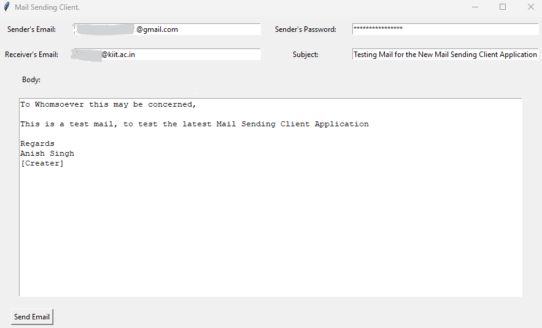
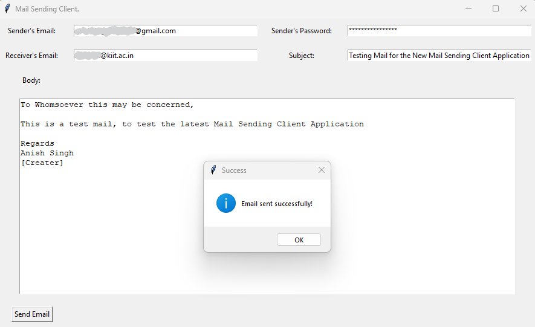
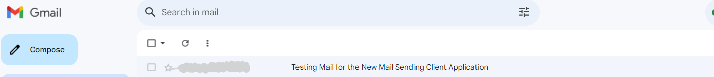

# Mail Sending Application

The Mail Sending Application is a simple Python GUI program that allows you to send emails using a graphical interface. The application uses the `tkinter` library for the graphical user interface and the `smtplib` library for sending emails through an SMTP server.

## Table of Contents

- [Features](#features)
- [Installation](#installation)
- [Usage](#usage)
- [Security Note](#security-note)
- [Screenshots](#screenshots)
- [License](#license)

## Features

- Send emails with specified sender and recipient addresses.
- Set the subject and body text for the email.
- Securely sends emails using TLS encryption.
- Easily customizable and expandable.

## Installation

1. Clone or download the repository to your local machine.
2. Make sure you have Python installed (Python 3.x is recommended).
3. Install the required libraries using the following command:

## Usage

1. Run the `mailing_app.py` script using Python.

2. The application GUI will appear.
3. Fill in the sender's email, sender's password, recipient's email, subject, and email body.
4. Click the "Send Email" button to send the email.

**Note:** If you're using Gmail as the sender's email, you might need to generate an application-specific password. Refer to the Gmail settings to learn more.

## Security Note

- This application demonstrates a basic email sending process and is intended for educational purposes.
- Storing passwords in the script is not recommended for production use. Consider using more secure methods for handling credentials.
- Always be cautious when sharing scripts that involve email authentication.

## Screenshots

Here are some screenshots of the Mail Sending Application in action:

  

 

## License

This project is licensed under the MIT License - see the [LICENSE](LICENSE) file for details.
